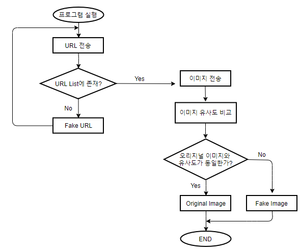
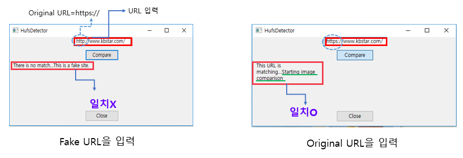

## URL과 Image Comparison을 이용한 웹사이트 위•변조 탐지 서비스

# 프로젝트 소개

> 본 서비스는 URL과 이미지 비교를 이용하여 공공기관 및 금융기관 웹 사이트의 위•변조 여부를 탐지하여 User에게 판단 결과까지 보여주는 응용 프로그램을 제공한다.
>

> 1) User가 은행 웹사이트에 접속하여 실행 프로그램에서 User가 접속해 있는 URL을 입력하면 URL이 서버로 전송된다.
>
> 2) 서버에서는 프로그램으로부터 받은 URL이 이전에 미리 저장해둔 Original URL list에 있는지 확인한다.
>
> 2-1) Original URL list에 없는 URL이라면, 프로그램을 통해 Fake site라는 결과를 User에게 보여준다.
>
> 2-2) Original URL list에 있는 URL이라면, 서버는 프로그램으로 이미지를 요청하고 프로그램은 User가 접속해 있는 사이트의 이미지를 캡쳐하여 서버로 전송한다. (3으로 이동)
>
> 3) 프로그램으로부터 받은 이미지로 Tensorflow 기반 Inception v3를 이용한 이미지 비교와 ImageHash 비교 기법을 이용하여 이미지 유사도 비교를 수행한다.
>
> 4) 프로그램으로부터 받은 이미지의 유사도가 해당 은행 웹사이트 이미지의 유사도와 동일하고, ImageHash 기법을 이용하여 해밍 거리가 0이라는 결과를 얻게 된다면 ‘Original Image’ 이므로 프로그램을 통해 User에게 ‘Original Site’ 라는 결과를 보여준다.

